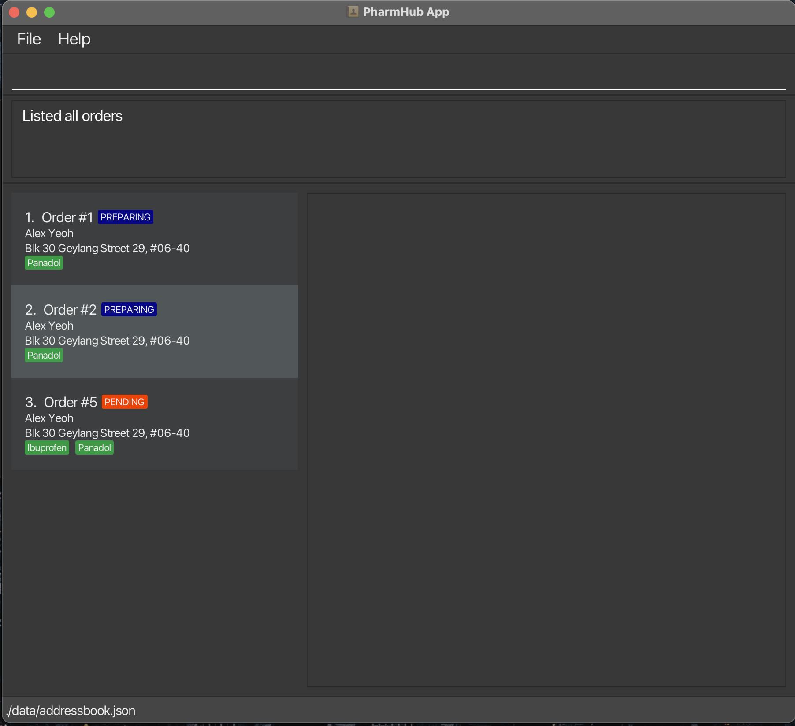
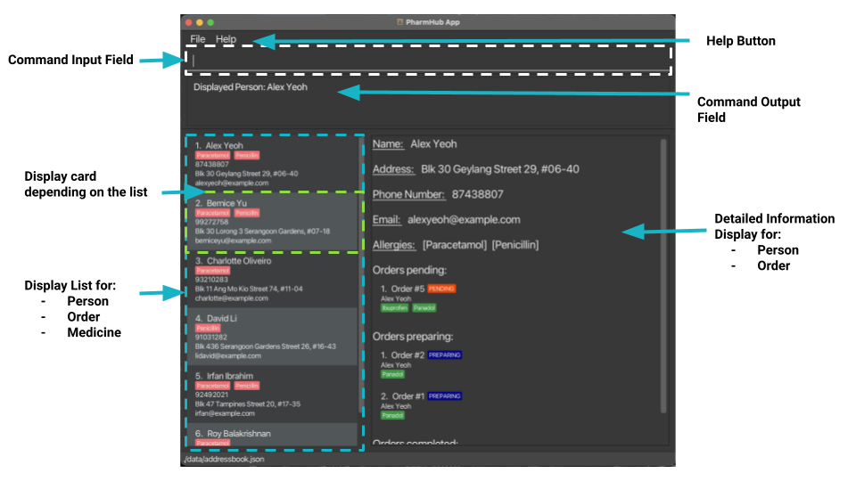
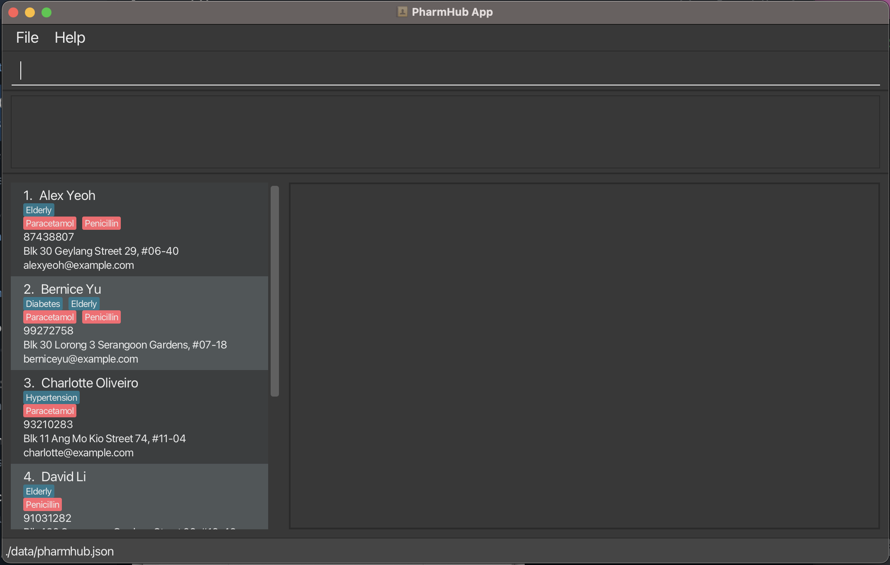
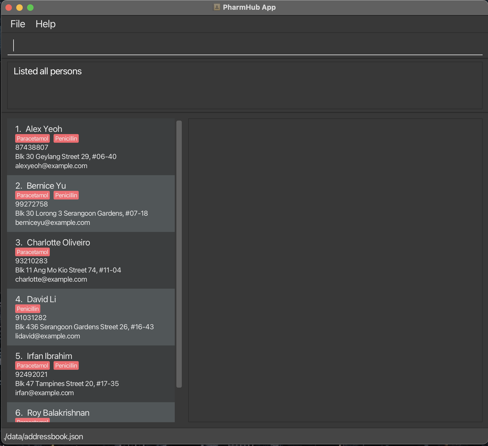
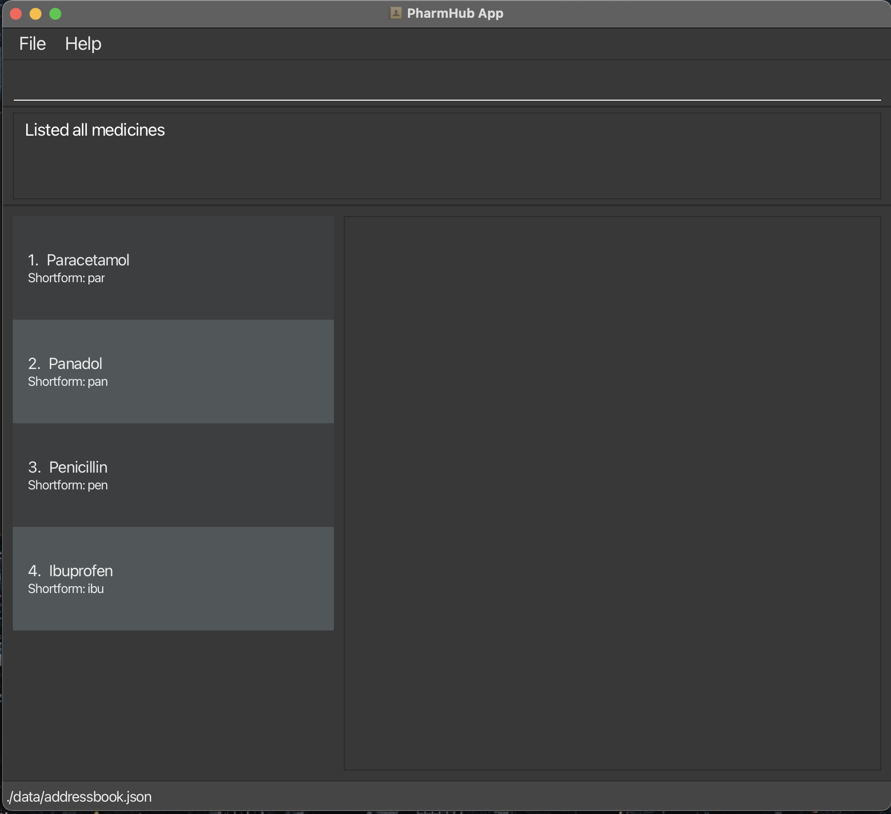
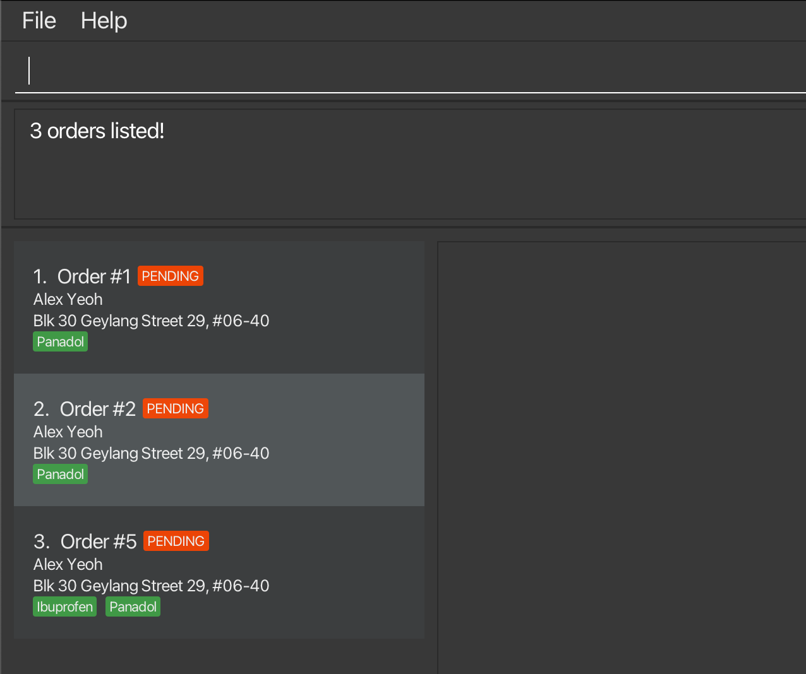
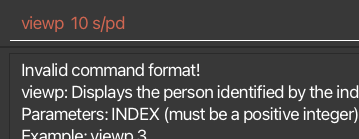
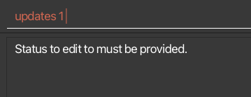
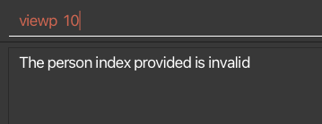

## Welcome to PharmHub!

--------------------------------------------------------------------------------------------------------------------

**PharmHub – Where Precision Meets Prescription**

PharmHub is the ideal solution for remote pharmacists seeking to enhance precision and maximise efficiency in their work.
  
A powerful desktop application designed for the meticulous management of patient details and their medication orders, PharmHub provides that much needed safety-net that all remote pharmacists only dream of having, ensuring that no errors slips through the cracks.
  
More than just your normal application, PharmHub is optimised to keep up with your fast fingers, allowing you to cruise through commands via its Command Line Interface (CLI), whilst offering an interactive GUI, if you should choose to use it.
  
PharmHub isn't just software. It's your ally in precision pharmaceutical management.

This guide aims to enlighten you on the workings of PharmHub, and empower you to utilise your new companion to the fullest. 

**Getting started in a breeze**:

* Jump around quickly via our [Table Of Contents](#table-of-contents-toc)
* Familiarise yourself with key [Definitions](#definitions)
* Get to know our GUI through our [Application Navigation](#application-navigation)
* Dive into our hands-on [Quick Start](#quick-start) guide
* Explore the array of capabilities in our [Features](#features) section
* Refresh your memory with our [Command Summary](#command-summary)
* Find solutions to issues faced at our [Troubleshooting](#troubleshooting) section
 
--------------------------------------------------------------------------------------------------------------------
## Table of Contents (TOC)
1. [Definitions](#definitions)
   1. [Medicine](#medicine)
   1. [Person](#person)
   1. [Order](#order)
   1. [Status](#status)
   1. [Fields](#fields)
   1. [Index](#index)
2. [Application Navigation](#application-navigation)
3. [Quick Start](#quick-start)
4. [Features](#features)
   1. [Help](#viewing-help--help)
   2. [Person Commands](#person-commands)
      1. [Add Person](#adding-a-person--addp)
      1. [List People](#listing-all-persons--listp)
      1. [Find Person](#finding-a-person--findp)
      1. [View Person](#viewing-a-person--viewp)
      1. [Edit Person](#editing-a-person--editp)
      1. [Delete Person](#deleting-a-person--deletep)
   3. [Medicine Commands](#medicine-commands)
       1. [Add Medicine](#adding-a-new-medicine--addm)
       1. [Add Short Form for Medicine](#adding-and-deleting-short-form--sfm)
       1. [List Medicines](#listing-all-medicines--listm)
       1. [Find Medicine](#finding-a-medicine--findm)
       1. [Delete Medicine](#deleting-a-medicine--deletem)
   4. [Order Commands](#order-commands)
      1. [Add Order](#adding-a-new-order--addo)
      1. [List Orders](#listing-all-orders--listo)
      1. [Find Order](#finding-an-order--findo)
      1. [View Order](#viewing-an-order--viewo)
      1. [Update Order Status](#updating-the-status-of-an-order--updates)
      1. [Delete Order](#deleting-an-order--deleteo)
   5. [Undo](#undoing-an-action--undo)
   6. [Redo](#redoing-an-undo-action--redo)
   7. [Clear](#clearing-all-entries--clear)
   8. [Exit](#exiting-the-program--exit)
5. [Command Summary](#command-summary)
6. [Troubleshooting](#troubleshooting)
   1. [FAQ](#faq)
   2. [Common Errors](#common-errors)
7. [Glossary](#glossary)

--------------------------------------------------------------------------------------------------------------------

## Definitions
Jump to [TOC](#table-of-contents-toc)

This section provides an introduction to the terminology used in this user guide. 

### Medicine

A medicine is the item to be packaged and delivered as part of fulfilling an order.

A Medicine has the following attribute:
- Full Name
- Short form (Optional)

Medicines are uniquely identified by their full and short form names. No two medicines can have the same names.

### Person

A person refers to the patient whom the pharmacist is addressing.

A person has the following attributes:
- Name
- Phone number
- Email Address
- Address
- Allergies (Can be zero or more)
- Tags (Optional for additional remarks/inputs for the person. Can be zero or more)

A person is uniquely identified by their name. No two persons can have the same name and names are case-insensitive.

### Order

An order refers to a purchase of one or more medicines by a particular person.

An Order has the following attributes:
- Order Number
- Person (Who the order belongs to)
- Medicines (Can be one or more)
- Status of the order

Orders are uniquely identified by their order numbers. No two orders can have the same order number. 
Orders can only be created for people that have been added into the PharmHub system.  
No order containing a medicine that the person is allergic to can be added without a special flag.   
Orders will automatically tag under the PENDING Status when added.

### Status

Status is used to describe the process at which the order is at.
Statuses can only be updated/modified following their chronological order. 

PENDING/PD
->
PREPARING/PR
->
COMPLETED/CP
->
CANCELED/CC

Statuses can be identified either in their full form or in their short form as shown above (FullForm/ShortForm).  
Statuses are case-insensitive.

### Fields
* Fields are the different parts of a command.  
e.g. in `editp 1 n/Alex no/penicillin`, there are four fields: `editp`, `1`, `Alex`, and `penicilllin`.    
* Excess spaces will be ignored.
As such `Alex Yeoh` will produce the same result as `Alex     Yeoh`  
* To input a `/` character in a field, use another `/` before it.   
If there is an odd  number of consecutive `/`, one of them will be ignored.  
  e.g To input `Roy s/o Balakrishnan`, use `Roy s//o Balakrishnan`

The following fields are used for commands:

| Field         | Prefix | Format                                                                                                        | Example                                    |
|---------------|--------|---------------------------------------------------------------------------------------------------------------|--------------------------------------------|
| Index         | -      | Must be a positive integer                                                                                    | `1`, `2`, `3`                              |
| Keyword       | -      | Must not be empty                                                                                             | `pan`, `Ah Tan s//o Ah Tan Tan`            |
| Command       | -      | Must be the first part of input and is case-insensitive                                                       | `addo`, `listm`                            |
| Name          | n/     | Must only contain alphanumeric, space, dot, slash,   hyphen and single quote characters. Case insensitive | `Roy s//o Balakrishnan`, `Connell O'Brien` |
| Phone number  | p/     | Must be numeric and be at least 3 digits long                                                                 | `999`, `68741616`                          |
| Email address | e/     | Must be a valid email address                                                                                 | `roy@gmail.com`, `Alex123@outlook.com`     |
| Tags          | t/     | Must contain alphanumeric characters only (no spaces)                                                         | `Diabetic`, `Elderly`                      |
| Address       | a/     | Must not be empty                                                                                             | `Sentosa cove`, `Pulau NTU`                |
| Status        | s/     | Must be a valid Status (Refer to [Status](#status))                                                           | `PENDIND`, `Cc`                            |
| Medicine      | m/     | Must not be empty and is not case sensitive.                                                                  | `metformin`, `panadol`                     |
| Allergy       | no/    | Must be a medicine name in PharmHub or its short form　                                                        | `panadol`, `pan`                           |

### Index

Index refers to the numbering in the last shown person/ order/ medicine list.

Refering to the image below, index `1` refers to `OrderNumber #1` while index `3` refer to `OrderNumber #5`.

All indices have to be positive integers.  

:information_source: **Note:** The list which the `INDEX` refers to will vary according to the command used, and is irrespective of which list is currently displayed.

---

## Application Navigation
Jump to [TOC](#table-of-contents-toc)

Below shows a guide on how you can navigate around our interactive Graphical User Interface (GUI)

| Component                  | Description                                                             | Remarks                                                        |
|----------------------------|-------------------------------------------------------------------------|----------------------------------------------------------------|
| Help Button                | Shows URL to our User Guide.                                            | -                                                              |
| Command Input Field        | Type commands here and press `Enter` to execute them.                   | -                                                              |
| Result Display Box         | Shows the result of the command execution.                              | -                                                              |
| Display List               | Shows a list of people/ orders/ medications                             | Type of list shown changes based on commands entered.          |
| Display Card               | Shows an overview of a particular person/ order/ medication in the list | -                                                              |
| Information Display        | Shows all details of a person/ order                                    | Object (Person/ Order) shown varies based on commands entered. |

---

## Quick start

Jump to [TOC](#table-of-contents-toc)

1. Ensure you have Java `11` or above installed in your Computer.
   * Run `java --version` in your command terminal to see the java version.
   * For both `Mac` and `Window` user click [here](https://nus-cs2103-ay2324s1.github.io/website/admin/programmingLanguages.html) for a guide to download the required `java` version for your computer.

2. Download the latest `PharmHub.jar` from [here](https://github.com/AY2324S1-CS2103T-W08-4/tp/releases).

3. Copy the file to the folder you want to use as the _home folder_ for your PharmHub.

4. Open a command terminal, `cd` into the folder you put the jar file in, and use the `java -jar pharmhub.jar` command to run the application. 
   A GUI similar to the below should appear in a few seconds. Note how the app contains some sample data. 
   

5. Type the command in the command box and press Enter to execute it. e.g. typing **`help`** and pressing Enter will open the help window. 
   Some example commands you can try:

   * `addm m/ibuprofen`: Adds a medicine named `Ibuprofen` to PharmHub.

   * `listm` : Lists all medicine.

   * `addp n/John Doe p/98765432 e/johnd@example.com a/John street, block 123, #01-01` : Adds a person named `John Doe` to PharmHub.

   * `addo 1 m/ibuprofen o/123`: Adds an order with order number `123` for person indexed `1` to PharmHub.

   * `listp` : Lists all people.

   * `viewp 1` : views in detail index 1 of the person list. (The Displayed list does not have to be the list of people)

   * `listo` : Lists all order.

   * `viewo 123` : views in detail Order #123 (Note: not index 123).
 
   * `updates 1 s/pr` : Updates the 1st order (index 1) of the order list to a status of PREPARING

   * `clear` : Deletes all people, orders, and medicines.

   * `undo` : Undoes the `clear` command

   * `exit` : Exits the app.

6. Refer to the [Features](#features) below for details of each command.

--------------------------------------------------------------------------------------------------------------------

## Features

Jump to [TOC](#table-of-contents-toc)

**:information_source: Notes about the command format:** 

* Words in `UPPER_CASE` are the parameters to be supplied by the user. 
  e.g. in `addp n/NAME`, `NAME` is a parameter which can be used as `addp n/John Doe`.

* Items in square brackets are optional. 
  e.g `n/NAME [t/TAG]` can be used as `n/John Doe t/friend` or as `n/John Doe`.

* Items with `…`​ after them can be used multiple times including zero times. 
  e.g. `[t/TAG]…​` can be used as ` ` (i.e. 0 times), `t/friend`, `t/friend t/family` etc.

* Parameters can be in any order. 
  e.g. if the command specifies `n/NAME p/PHONE_NUMBER`, `p/PHONE_NUMBER n/NAME` is also acceptable.

* Extraneous parameters for commands that do not take in parameters (such as `help`, `list`, `exit` and `clear`) will be ignored. 
  e.g. if the command specifies `help 123`, it will be interpreted as `help`.

* If you are using a PDF version of this document, be careful when copying and pasting commands that span multiple lines as space characters surrounding line-breaks may be omitted when copied over to the application.

### Viewing help : `help`

Shows a message explaining how to access the help page.

Format: `help`

### *Person Commands*
Jump to [TOC](#table-of-contents-toc)

### Adding a person : `addp`

Adds a person to PharmHub.

Format: `addp n/NAME p/PHONE_NUMBER e/EMAIL a/ADDRESS [t/TAG]… [no/ALLERGY]…​`

:bulb: **Tip:**
A person can have any number of tags or allergies (including 0)

Examples:
* `addp n/John Doe p/98765432 e/johnd@example.com a/John street, block 123, #01-01 no/paracetamol no/penicillin`
* `addp n/Betsy Crowe t/friend e/betsycrowe@example.com a/Newgate Prison p/1234567 t/criminal`

### Listing all persons : `listp`

Shows an interactive list of all persons in PharmHub.

Format: `listp`

### Finding a person : `findp`

Finds persons whose names, phone numbers, emails, tags, and allergies match the given inputs.

Format: `findp [n/KEYWORD [MORE_KEYWORDS]…] [p/PHONE_NUMBER] [e/EMAIL] [no/KEYWORD [MORE_KEYWORDS]…]`

* The search for name, tags and allergies are case-insensitive. e.g `hans` will match `Hans`
* The order of the keywords does not matter. e.g. `Hans Bo` will match `Bo Hans`
* Only full words will be matched e.g. `Han` will not match `Hans`
* Persons matching at least one keyword will be returned (i.e. `OR` search).
  e.g. `Hans Bo` will return `Hans Gruber`, `Bo Yang`
* The search for phone number and email are case-sensitive and must be an exact match.
  e.g. `9123456` will not match `91234567` and `johndoe@example` does not match `johndoe@example.com`

Examples:
* `findp n/Alex david` returns `Alex Yeoh`, `David Li` 
* `findp no/paracetamol penicillin`
  

### Viewing a person : `viewp`

Displays the specified person with more details in the info panel.

Format: `viewp INDEX`

Examples:
* `listp` followed by `viewp 2` opens the 2nd person in the list into the info panel.

### Editing a person : `editp`

Edits an existing person in the PharmHub.

Format: `editp INDEX [n/NAME] [p/PHONE] [e/EMAIL] [a/ADDRESS] [t/TAG]… [no/ALLERGY]…​ [ia/]`

* Edits the person at the specified `INDEX`. The index refers to the index number shown in the last displayed person list. The index **must be a positive integer** 1, 2, 3, …​
* At least one of the optional fields must be provided.
* This command will not be able to add/delete orders to this person.
* Existing values will be updated to the input values.
* When editing tags or allergies, the existing tags or allergies of the person will be removed i.e adding of tags is not cumulative.
* You can remove all the person’s tags by typing `t/` without
    specifying any tags after it.
* You can remove all the person’s allergies by typing `no/` without
    specifying any allergies after it.
* If the editing causes the person to be allergic any of the orders belonging to them, a warning will be raised.
* The warning can be overridden by adding the `ia/` to the command

Examples:
*  `editp 1 p/91234567 e/johndoe@example.com` Edits the phone number and email address of the 1st person to be `91234567` and `johndoe@example.com` respectively.
*  `editp 2 n/Betsy Crower t/` Edits the name of the 2nd person to be `Betsy Crower` and clears all existing tags.
*  `editp 3 no/` Edits the allergies of the 3rd person to be empty.

### Deleting a person : `deletep`

Deletes the specified person from PharmHub.

Format: `deletep INDEX`

* Deletes the person at the specified `INDEX`.
* The index refers to the index number shown in the last displayed person list.
* The index **must be a positive integer** 1, 2, 3, …​

:exclamation: **Caution:**
Deleting a person also deletes all orders corresponding to the person from PharmHub.

Examples:
* `listp` followed by `deletep 2` deletes the 2nd person in PharmHub.
* `findp n/David` followed by `deletep 1` deletes the 1st person in the results of the `find` command.

---

### *Medicine Commands*
Jump to [TOC](#table-of-contents-toc)

### Adding a new medicine : `addm`

Adds a new medication into PharmHub.  

Format: `addm m/MEDICINE_NAME`

* The given name shouldn't match the name or short form of any medicine in PharmHub.   
* Medicine names are case-insensitive.

Example:
* `addm m/Aspirin`

### Adding and Deleting short form : `sfm`

Adds or Deletes a short form from the specified medicine from PharmHub.

Format: `sfm INDEX [m/SHORT_FORM] [d/]`

* Index refers to index of medicine in the last displayed medicine list.
* At least one of `m/` or `d/` must be provided.
* If the `d/` is not provided, the given short form will be added to the medicine at the specified `INDEX`.
   * The provided short form must not be empty and must not be same as any existing medicine name or short form in PharmHub.
   * Any existing short form of the medicine will be overwritten.
   * After this, the short form can be used interchangeably with the medicine name.
* If the `d/` is provided, the short form(if any) of the medicine at the specified `INDEX` will be deleted.
   * Any short form provided using `m/` will be ignored.

Example:
* `sfm 1 m/pan`
* `sfm 1 d/`

### Listing all medicines : `listm`

Shows a list of all medicines in PharmHub.  

Format: `listm`

### Finding a medicine : `findm` 

Finds all medicines whose name or short form contains any of the given keywords.  

Format : `Format: findm KEYWORD [MORE_KEYWORD]…`

* The search is case-insensitive. e.g `pan` will match `Panadol`
* The medicine name and it's short form is searched.
* Medicines matching at least one keyword will be returned (i.e. `OR` search).
  e.g. `ol en` will return `Panadol`, `Ibuprofen`

:information_source: **Note:** Unlike `findp`, partial words will be matched e.g. `para` will  match `Paracetamol`.

Examples:
* `findm ol`
* `findm ol para`

### Deleting a medicine : `deletem`

Deletes the specified medicine from PharmHub.

Format: `deletem INDEX`

* Deletes the medicine at the specified `INDEX`.
* The index refers to the index number shown in the last displayed medicine list.
* The index **must be a positive integer** 1, 2, 3, …​ 
* The command will be blocked if there are existing orders with the specified medicine 
  or persons allergic to the specified medicine.

Example:
* `deletem 2`

---

### *Order Commands*
Jump to [TOC](#table-of-contents-toc)

### Adding a new order : `addo`

Adds a new order of the given medication(s) corresponding to a person into the system.

Format: `addo INDEX o/ORDER_NUMBER m/MEDICINE_NAME [m/MEDICINE_NAME]…​ [ia/]`

* Orders are created automatically having a `status` of `pending`.
* Orders can only be created for a person in the index range, and with known `medicine`s.
* Orders created for persons with an allergy to any of the medications in the order will raise a warning.
* The warning can be overridden by adding the `ia/` to the command

Parameters:
* `INDEX` - index of patient who is ordering the medicine as shown in the last displayed patient list.
* `ORDER_NUMBER` - the order number of this order specified by the invoice.
* `MEDICINE_NAME` - the name of medicine being ordered.

Examples:
* `addo 1 o/618457 m/panadol`
* `addo 3 o/438756 m/par` -> `addo 3 o/438756 m/par ia/`

### Listing all orders : `listo` 

Shows an interactive list of all orders in PharmHub.

Format: `listo`

### Finding an Order : `findo`

Finds orders whose status and medicines match the given inputs.

Format: `findo [s/STATUS] [m/MEDICINE_NAME]…`

* The search is case-insensitive. e.g `PANADOL` will match `Panadol`, `COMPLETED` or `CP` will match `Completed`.
* Users can find orders based on either status or medicines or both.
* Status can only be `Pending/PD Preparing/PR Completed/CP Cancelled/CC`, any other inputs will be invalid.
* Medicine can be written both in their short form and full form. `pan` will match `Panadol`.
* Multiple Medicine can be used as input separated by a blank space and a Prefix `/m`, but only one status can be used.
* Orders that contain any one of the medication/Status will be shown.
* In the event both status and medicines are specified, only orders that have the given status **AND** has medicines containing **any** of the given medicine name substrings will be shown.

Examples:
* `findo m/Panadol m/Ibuprofen` returns all orders with either `Panadol` or `Ibuprofen`.
* `findo s/pd m/Panadol` returns all orders that is both PENDING and contains `Panadol`.
* `findo s/pd m/pan m/pen` returns all orders that is both PENDING **AND** contains one of `pan` or `pen`

### Viewing an order : `viewo` 

Shows the order in the info panel.

Format: `viewo ORDER_NUMBER`

Examples: `viewo 123`

:information_source: **Note:** Unlike `viewp`, `viewo` expects an `Order Number` instead of an `Index` 

### Updating the status of an order : `updates`

Updates the status of the order to the designated status.

Format: `updates INDEX s/STATUS`

* Statuses: `Pending (pd) -> Preparing (pr) -> Completed (cp) -> Cancelled (cc)`, in increasing hierarchy
* Statuses can only be updated upwards. Once the status of an order progresses to the next stage, it cannot go back.
* Statuses can be updated by skipping the hierarchy. `Pending -> Cancelled`
* Shorthands can be used in replacement of the full names of the statuses

Example: 
* `updates 1 s/completed`
* `updates 1 s/COMPLETED`
* `updates 1 s/cp`
* `updates 1 s/CP`

### Deleting an order : `deleteo` 

Deletes the specified order from PharmHub.

Format: `deleteo INDEX`

Example: `deleteo 2`

---

### Undoing an action : `undo` 

Undoes the last data-modifying action.

Format: `undo`

* Limited to last 30 actions.
* Does not undo Ui views (eg. find, view commands). 

Example: 
* `addp` -> `listp` -> `undo` will undo the `addp` command

### Redoing an undo action : `redo` 

Negates the effect of the last undo.

Format: `redo`

* The undo command must have been the latest data-modifying command.
* Once a non-`undo` data-modifying command is executed, redoing undoes before that non-`undo` command is no longer possible

Example:
* `addp` -> `undo` -> `addp` -> `redo`  will throw an error
* `addp` -> `undo` -> `listp` -> `redo` will redo the `addp` command successfully

### Clearing all entries : `clear`

Clears all entries (Person, Orders, and Medicines) from PharmHub.

Format: `clear`

### Exiting the program : `exit`

Exits the program.

Format: `exit`

### Saving the data

PharmHub data are saved in the hard disk automatically after any command that changes the data. There is no need to save manually.

### Editing the data file

PharmHub data are saved automatically as a JSON file `[JAR file location]/data/pharmhub.json`. Advanced users are welcome to update data directly by editing that data file.

:exclamation: **Caution:**
If your changes to the data file makes its format invalid, PharmHub will discard all data and start with an empty data file at the next run. Hence, it is recommended to take a backup of the file before editing it.

--------------------------------------------------------------------------------------------------------------------

## Command Summary
Jump to [TOC](#table-of-contents-toc)

| Action                    | Format                                                                                        | Examples                                                                                                       |
|---------------------------|-----------------------------------------------------------------------------------------------|----------------------------------------------------------------------------------------------------------------|
| **Add Person**            | `addp n/NAME p/PHONE_NUMBER e/EMAIL a/ADDRESS [t/TAG] [no/ALLERGY]…​`                         | `addp n/James Ho p/22224444 e/jamesho@example.com a/123, Clementi Rd, 1234665 t/Diabetic t/Elderly no/aspirin` |
| **List People**           | `listp`                                                                                       | `listp`                                                                                                        |
| **Find Person**           | `findp [n/KEYWORD [MORE_KEYWORDS]…] [p/PHONE_NUMBER] [e/EMAIL] [no/KEYWORD [MORE_KEYWORDS]…]` | `findp n/James Jake`                                                                                           |
| **View Person**           | `viewp INDEX`                                                                                 | `viewp 1`                                                                                                      |
| **Edit Person**           | `editp INDEX [n/NAME] [p/PHONE_NUMBER] [e/EMAIL] [a/ADDRESS] [t/TAG] [no/allergy]…​`          | `editp 2 n/James Lee e/jameslee@example.com`                                                                   |
| **Delete Person**         | `deletep INDEX`                                                                               | `deletep 3`                                                                                                    |
| **Add Order**             | `addo INDEX o/ORDER_NUMBER m/MEDICINE_NAME [m/MEDICINE_NAME]…`                                | `addo 3 o/438756 m/claritin`                                                                                   |
| **List Orders**           | `listo`                                                                                       | `listo`                                                                                                        |
| **Find Order**            | `findo [s/STATUS] [m/MEDICINE_NAME]…`                                                         | `findo s/cp m/pen`                                                                                             |
| **View Order**            | `viewo ORDER_NUMBER`                                                                          | `viewo 12345`                                                                                                  |
| **Update Order Status**   | `updates INDEX s/STATUS`                                                                      | `updates 1 s/cc`                                                                                               |
| **Delete Order**          | `deleteo INDEX`                                                                               | `deleteo 3`                                                                                                    |
| **Add Medicine**          | `addm m/MEDICINE_NAME`                                                                        | `addm m/panadol`                                                                                               |
| **Add/Delete Short Form** | `sfm INDEX [m/SHORT_FORM] [d/]`                                                               | `sfm 1 m/met`                                                                                                  |
| **List Medicine**         | `listm`                                                                                       | `listo`                                                                                                        |
| **Find Medicine**         | `findm KEYWORD [MORE_KEYWORDS]…`                                                              | `findm ol`                                                                                                     |
| **Delete Medicine**       | `deletem INDEX`                                                                               | `deletem 1`                                                                                                    |
| **Undo**                  | `undo`                                                                                        | `undo`                                                                                                         |
| **Redo**                  | `redo`                                                                                        | `redo`                                                                                                         |
| **Clear**                 | `clear`                                                                                       | `clear`                                                                                                        |
| **Help**                  | `help`                                                                                        | `help`                                                                                                         |
| **Exit**                  | `exit`                                                                                        | `exit`                                                                                                         |

---

## Troubleshooting
Jump to [TOC](#table-of-contents-toc)

### FAQ

**Q**: The application is not running on my computer. 
**A**: Refer to our [Quick Start](#quick-start) to ensure that you downloaded the correct java version.

**Q**: Will I lose my data if i exit the application? 
**A**: No you will not. The data is stored on your computer and as long as you don't delete the `.jar` file, your data will be stored.

**Q**: I accidentally deleted the `PharmHub.jar` file can i get my data back? 
**A**: Unfortunately, the data cannot be recovered once the `.jar` file is deleted so make sure to keep it at a secure location.

**Q**: Is my patient data secure? 
**A**: Yes, as long as your computer is secure no one else will be able to access the information.

**Q**: Is internet connection required? 
**A**: Nope, PharmHub do not require internet connection.

Click [here](https://github.com/AY2324S1-CS2103T-W08-4/tp/issues) to view some issues posted by some of our users to see if it solves yours.
 
Click [here](https://github.com/AY2324S1-CS2103T-W08-4/tp/issues/new) to feedback on issues you faced that we didn't answer on.

### Common Errors

1. **When using multiple screens**, if you move the application to a secondary screen, and later switch to using only the primary screen, the GUI will open off-screen. The remedy is to delete the `preferences.json` file created by the application before running the application again.

2. Common Error messages

   1. `Unknown Command` Error
       
        Check [Command Summary](#command-summary) and make sure the input command is a valid commmand.
        
   2. `Ivalid Command Format` Error
       
        Either read the error message and edit accordingly or look at the command [Features](#features) for detailed explanation.
        
   3. `Missing Field` Error
       
        Check the command [feature](#features) to identify the missing input.
        
   4. `Invalid Index` Error
       
        Check through the display list and ensure a valid index is chosen. [Index](#index)
        
   5. `Invalid Input` Error
       
        Refer to the [fields](#fields) to ensure the validity of the input fields.
        
   6. `Invalid Chronological Order` Error
        Ensure that the [status](#status) is of correct chronological order.
       
   
--------------------------------------------------------------------------------------------------------------------

## Glossary
Jump to [TOC](#table-of-contents-toc)

| Term                 | Meaning                                                                                                               |
|----------------------|-----------------------------------------------------------------------------------------------------------------------|
| **CLI**              | Command Line Interface(CLI) is a text based interface where users can input commands.                                 |
| **Command Terminal** | A program which allows users to enter commands that the computer processes.                                           |
| **`cd`**             | The command used in command terminal to change directory.                                                             |
| **Gui**              | Graphical User Interface(GUI) is the digital interface that the user interacts with.                                  |
| **Java**             | Java is a widely used programming language and is used in PharmHub.                                                   |
| **Jar**              | Java Archive contains all of the various components that make up a Java application, in this case PharmHub.           |
| **Json**             | JavaScript Object Notation(Json) is a text format for storing data. It is used by PharmHub to store application data. |  
| **TOC**              | [Table of Contents](#table-of-contents-toc)                                                                         |
